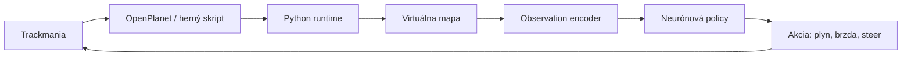

# Kostra kapitoly Návrh riešenia a implementácia prístupu

Tento dokument je pracovná osnova prvej konkrétnej kapitoly po teoretickej časti a súvisiacich prácach. Jej cieľom je ukázať, ako sme z hry Trackmania vytvorili prostredie, v ktorom môže autonómny agent vnímať stav sveta, rozhodovať sa a aplikovať akcie bez toho, aby sme ako hlavný vstup používali obraz z obrazovky.

Kapitola má začať jednoduchou otázkou: máme iba hru, ale potrebujeme z nej spraviť prostredie pre agenta. Hra beží, auto sa pohybuje, trať existuje v hernom svete, ale agent sám od seba nevidí nič. Musíme preto navrhnúť spôsob, ako mu svet sprostredkovať.

Na konci tejto kapitoly má byť jasné, že máme uzavretý rozhodovací cyklus:

```text
stav hry -> observation -> policy -> action -> nový stav hry
```

Samotný tréning policy bude patriť až do ďalšej kapitoly. Tu ešte neriešime, ako nájsť najlepšie váhy neurónovej siete. Riešime, čo agent vidí, čo môže spraviť a ako prepájame Trackmaniu s vlastným výpočtovým prostredím.

## 1. Nadviazanie na bakalársku prácu

Táto časť má vecne zhrnúť, na čom diplomová práca stavia. Netreba bakalársku prácu zhadzovať. Bola to prvá verzia systému a veľa základných nápadov bolo správnych. Zároveň však treba otvorene pomenovať, čo bolo potrebné pre diplomovku zlepšiť.

Čo sa v bakalárskej práci podarilo:

- použiť Trackmaniu ako bezpečné virtuálne prostredie,
- získať základné údaje o aute cez OpenPlanet alebo vlastný herný skript,
- exportovať mapové bloky a rekonštruovať trať mimo hry,
- použiť geometrickú reprezentáciu namiesto samotného obrazu,
- vytvoriť prvú verziu lidarového vnímania,
- vytvoriť prvého agenta, ktorý dokázal aplikovať akcie späť do hry.

Čo bolo v bakalárskej práci slabšie:

- experimentálne vyhodnotenie nebolo dostatočne systematické,
- reward a metriky neboli opísané dosť presne,
- trénovacia metóda nebola vysvetlená do hĺbky,
- reprezentácia okolia auta bola ešte zjednodušená,
- chýbala robustnejšia práca s kolíziami, rozmermi auta, časovaním a opakovateľnosťou experimentov.

Ako na to nadväzuje diplomová práca:

- základná myšlienka ostáva rovnaká: agent nemusí pozerať na obraz, ak mu vieme svet opísať geometricky,
- systém je presnejšie rozdelený na vnímanie, reprezentáciu prostredia, rozhodovanie a tréning,
- namiesto jednej demonštrácie chceme mať merateľné experimenty,
- dôraz sa presúva z prototypu na obhájiteľný výskumný postup.

Táto časť má byť most medzi minulosťou a novým návrhom. Dobrá formulácia je: bakalárska práca ukázala, že smer je možný; diplomová práca rieši, ako ho spraviť presnejší, stabilnejší a vyhodnotiteľný.

## 2. Prečo nepoužiť obraz ako hlavný vstup

V súvisiacich prácach sa objavujú prístupy, ktoré používajú obraz z obrazovky alebo kamerový pohľad. Je to prirodzený spôsob, pretože človek tiež jazdí podľa vizuálneho vnemu. Pre náš cieľ však obraz nie je najvýhodnejší hlavný vstup.

Problémy obrazového vstupu:

- obraz obsahuje veľa informácií, ktoré nemusia byť pre riadenie priamo potrebné,
- model by sa musel učiť naraz percepciu aj samotné riadenie,
- spracovanie obrazu môže byť výpočtovo drahšie,
- realtime odozva môže byť problém, ak sa má agent rozhodovať často,
- interpretácia toho, čo sa sieť naučila, je ťažšia.

Náš cieľ je iný:

- vytvoriť kompaktný vstup,
- oddeliť geometrické vnímanie od učenia policy,
- dať agentovi informácie, ktoré sú priamo spojené s jazdou,
- zachovať možnosť analyzovať, prečo sa agent správal určitým spôsobom.

Týmto nadväzujeme na kritiku image-based prístupov, ale netvrdíme, že obraz je zlý. Skôr hovoríme, že v tejto práci skúmame inú cestu: namiesto toho, aby sa sieť musela naučiť vnímať cestu z pixelov, rekonštruujeme svet geometricky a agentovi posielame už spracované pozorovanie.

## 3. Získanie stavu z Trackmanie

Na začiatku máme iba bežiacu hru. Trackmania nebola navrhnutá ako výskumné prostredie pre autonómnych agentov. Hra síce interne pozná pozíciu auta, jeho rýchlosť a fyzikálny stav, ale tieto údaje nie sú automaticky pripravené vo forme, ktorú by mohol použiť náš agent.

Pomocou skriptu v hre vieme získať základné údaje o aute, napríklad:

- pozíciu auta v hernom svete,
- smer auta,
- rýchlosť a bočnú rýchlosť,
- herný čas,
- informácie o vstupoch alebo fyzikálnom kroku,
- ďalšie pomocné hodnoty dostupné z runtime stavu hry.

Samotné tieto údaje však nestačia. Poloha auta je iba číslo v súradnicovom systéme. Bez znalosti trate nevieme, či je auto na rovinke, pred zákrutou, pri stene, mimo cesty alebo blízko cieľa. Inými slovami, telemetry auta sú dôležité, ale sú neúplné. Aby sa z nich stal zmysluplný stav pre agenta, musíme ich spojiť s reprezentáciou prostredia.

Tu je dobré zdôrazniť dôležitú myšlienku: agent nepotrebuje iba vedieť, kde je auto. Potrebuje vedieť, čo táto poloha znamená vzhľadom na trať.

## 4. Rekonštrukcia virtuálneho sveta

Trackmania trate sú zložené z blokov. To je pre nás výhodné, pretože trať nie je úplne neznáma spojitá geometria, ale skladá sa z opakovateľných stavebných prvkov. Z herných súborov alebo exportovaných dát vieme získať informáciu o tom, aké bloky sa na trati nachádzajú, kde sú umiestnené a ako sú otočené.

Z týchto informácií skladáme vlastné virtuálne prostredie:

- načítame zoznam blokov trate,
- ku každému bloku priradíme jeho geometriu,
- bloky umiestnime do spoločného súradnicového systému,
- rozlíšime prejazdné časti trate a steny alebo okraje,
- vytvoríme reprezentáciu, v ktorej vieme robiť geometrické výpočty.

Kľúčová vlastnosť je, že poloha auta v Trackmanii zodpovedá polohe auta v našom virtuálnom prostredí. Ak teda skript z hry pošle súradnice auta, vieme túto pozíciu preniesť do vlastnej rekonštruovanej mapy a pýtať sa otázky typu:

- čo je pred autom,
- ako ďaleko je najbližšia stena,
- akým smerom pokračuje trať,
- kde je auto vzhľadom na logickú cestu k cieľu.

Výsledkom je obchádzka okolo obrazového vnímania. Nepozeráme sa na obrazovku, ale vytvoríme si vlastný geometrický model sveta, v ktorom vieme vypočítať pozorovanie pre agenta.

## 5. Geometrické vnímanie prostredia

Keď máme rekonštruovanú mapu a aktuálnu polohu auta, môžeme vytvoriť virtuálne senzory. Najdôležitejším príkladom je raycasting, teda vysielanie lúčov z auta do okolia a meranie vzdialenosti k prekážkam.

V texte treba vysvetliť:

- lúč začína v blízkosti auta,
- má určitý smer vzhľadom na orientáciu auta,
- hľadáme miesto, kde pretne stenu alebo okraj cesty,
- výsledkom je vzdialenosť, ktorá hovorí, koľko priestoru má auto v danom smere.

Starší prístup používal lúče vychádzajúce z jedného bodu, typicky zo stredu auta. To je jednoduché, ale má nevýhodu: auto nie je bod. Ak sa stred auta ešte nachádza na ceste, ale jeho okraj už zasahuje do steny, bodový lidar to nemusí zachytiť správne.

Preto je vhodné vysvetliť prechod k vnímaniu vzhľadom na rozmery auta:

- auto má približný pôdorys,
- kolízia závisí od jeho okrajov, nie iba od stredu,
- vzdialenosť k stene sa má interpretovať ako clearance vzhľadom na tvar auta,
- hodnota `0` znamená kontakt alebo dotyk s prekážkou.

Táto časť je dobré miesto na obrázok:

- auto ako obdĺžnik,
- lúče smerujúce dopredu a do strán,
- stena alebo okraj cesty,
- porovnanie bodového lúča zo stredu a clearance lúča vzhľadom na rozmery auta.

Pointa tejto časti: vodič potrebuje vedieť, kde má priestor. Lidarové vzdialenosti sú kompaktný spôsob, ako túto informáciu dostať do neurónovej siete.

## 6. Observation vektor

Observation je spracovaný vstup, ktorý dostane policy. Nemá to byť náhodný zoznam čísel. Každá skupina príznakov má mať význam pre rozhodovanie auta.

Observation je vhodné rozdeliť na skupiny:

- geometrické informácie pred autom,
- orientácia auta vzhľadom na trať,
- informácie o pohybe auta,
- časovanie fyziky,
- voliteľné informácie o výške,
- voliteľné informácie o povrchu.

Geometria pred autom:

- lidar alebo clearance vzdialenosti,
- informácia o tom, či má auto pred sebou priestor,
- lokálne rozlíšenie stien a okrajov trate.

Orientácia voči trati:

- smer ďalšieho úseku trate,
- rozdiel medzi smerom auta a smerom trate,
- informácia, či auto smeruje približne tam, kam má.

Pohyb auta:

- dopredná rýchlosť,
- bočná rýchlosť,
- zrýchlenie alebo zmena rýchlosti,
- uhlová zmena smeru.

Časovanie fyziky:

- hra nemusí vždy poskytnúť nový stav po rovnakom fyzikálnom kroku,
- agent nevie dopredu, aký veľký krok nastane,
- v novej observation však vie dostať informáciu o tom, aký fyzikálny interval práve prebehol,
- preto používame feature typu `physics_delay_norm`.

Tu treba vysvetliť opatrne: `physics_delay_norm` nie je predpoveď budúcnosti. Je to informácia o predchádzajúcom fyzikálnom kroku, ktorá pomáha policy interpretovať nové pozorovanie.

Progress:

- pod pojmom `progress` v aktuálnej práci myslíme plynulý geometrický postup po trati,
- nejde iba o hrubý počet prejdených blokov,
- takýto progress je užitočný pri vyhodnocovaní aj pri kreslení tréningových kriviek.

Voliteľné moduly:

- výškový modul rozširuje observation o informácie dôležité pri kopcoch a svahoch,
- povrchový modul rozširuje observation o typ povrchu, ktorý môže ovplyvniť správanie auta,
- v tejto kapitole ich stačí predstaviť ako rozšírenia reprezentácie, detailné experimenty patria neskôr.

## 7. Akčný priestor

Ak policy dostane observation, musí vybrať akciu. V Trackmanii sú základné akcie podobné ako pri ľudskom ovládaní auta:

- plyn,
- brzda,
- zatáčanie.

V práci treba vysvetliť, že existuje viac spôsobov, ako tieto akcie reprezentovať. Napríklad:

- spojitý plyn a brzda,
- binárny plyn a brzda,
- spojité zatáčanie,
- kombinované akcie, kde jedna hodnota predstavuje throttle.

Hlavný variant používa logiku `gas_brake_steer`:

- plyn a brzda sú samostatné akcie,
- plyn a brzda sú binárne alebo prahované,
- zatáčanie je spojitá hodnota,
- výstup policy sa dá priamo preložiť na vstupy podobné tým, ktoré posiela hráč cez ovládač.

Treba zdôrazniť, že policy nevytvára abstraktný plán typu “choď do ďalšej zákruty”. Produkuje priamu akciu, ktorú aplikujeme do hry. To zjednodušuje rozhranie, ale zároveň kladie veľký nárok na to, aby observation obsahovala dostatok informácií pre okamžité rozhodnutie.

## 8. Rozhodovací cyklus agenta

Táto časť má spojiť predchádzajúce bloky do jedného cyklu.

Základný krok:

1. Trackmania beží a auto sa nachádza v určitom stave.
2. Skript v hre odošle aktuálne údaje o aute.
3. Python časť systému prijme stav auta.
4. Virtuálna mapa dopočíta geometrické informácie o okolí.
5. Observation encoder vytvorí vstupný vektor.
6. Neurónová sieť vypočíta akciu.
7. Akcia sa pošle späť do hry.
8. Hra pokračuje a vznikne nový stav.

Jednoduchý diagram:

```text
Trackmania
    |
    v
stav auta z hry
    |
    v
virtuálna mapa + geometrické výpočty
    |
    v
observation
    |
    v
policy
    |
    v
action
    |
    v
Trackmania
```

Možný UML alebo data-flow diagram pre finálnu prácu:



V texte k diagramu treba povedať, že toto nie je iba implementačná schéma. Je to hlavný koncept práce: reálna hra beží oddelene, ale agent ju vníma cez nami vytvorenú reprezentáciu.

## 9. Rozdiel medzi live Trackmaniou a TM2D

Live Trackmania je cieľové prostredie. To znamená, že konečný agent musí jazdiť v skutočnej hre. Má to však praktický problém: vyhodnocovanie je pomalé, realtime, ťažšie paralelizovateľné a každá chyba stojí skutočný čas.

Preto vzniká zjednodušené lokálne prostredie TM2D.

Live Trackmania:

- je cieľové prostredie,
- používa skutočnú fyziku hry,
- je časovo drahá,
- je menej pohodlná na veľké množstvo experimentov.

TM2D:

- je lokálny výskumný sandbox,
- používa zjednodušenú fyziku,
- umožňuje rýchlejší tréning a analýzu,
- je vhodná na testovanie reward funkcií, architektúr a GA parametrov,
- nenahrádza finálnu validáciu v hre.

Formulácia musí byť opatrná. TM2D nie je tvrdenie, že sme presne replikovali Trackmaniu. Je to nástroj, ktorý nám umožňuje lacnejšie overiť nápady predtým, než ich použijeme v reálnej hre.

Táto časť je tiež dobré miesto na vysvetlenie, prečo v práci budeme rozlišovať medzi:

- rýchlym lokálnym experimentom,
- live experimentom v Trackmanii,
- finálnym hodnotením kvality jazdy.

## 10. Záver kapitoly

Záver by mal krátko zopakovať, čo sme v kapitole postavili.

Máme:

- spôsob, ako získať stav auta z hry,
- rekonštruovanú virtuálnu mapu,
- geometrické vnímanie prostredia bez obrazu,
- observation vektor,
- akčný priestor,
- uzavretý rozhodovací cyklus,
- lokálny TM2D sandbox na lacnejšie experimentovanie.

Tým sa dostávame k ďalšej otázke. Policy vieme spustiť. Vieme jej dať observation a vieme jej akciu aplikovať späť do hry. Zatiaľ však nevieme, aké parametre má mať neurónová sieť, aby sa správala dobre.

Prirodzený prechod do ďalšej kapitoly:

```text
Teraz už máme agenta, ktorý dokáže vnímať a konať. Ostáva vyriešiť ťažšiu časť: ako nájsť policy, ktorá bude jazdiť dobre.
```

## Obrázky a diagramy, ktoré sa oplatí pripraviť

Odporúčané obrázky:

- celkový data-flow diagram Trackmania -> skript -> virtuálna mapa -> observation -> policy -> action,
- ilustrácia trate ako skladby blokov,
- ukážka rekonštruovanej mapy z top-down pohľadu,
- lidar/raycasting schéma,
- porovnanie center-lidar a hitbox-aware clearance lidar,
- observation-action loop,
- porovnanie live Trackmania a TM2D ako dvoch prostredí.

Pri obrázkoch treba dávať pozor, aby neboli iba dekorácia. Každý obrázok má odpovedať na konkrétnu otázku:

- odkiaľ prichádzajú dáta,
- ako agent vníma svet,
- ako sa z pozície auta stane observation,
- ako sa z výstupu siete stane akcia v hre.

## Čo do tejto kapitoly ešte nepatrí

Do tejto kapitoly ešte nepatrí:

- detailné porovnanie reward funkcií,
- výsledky GA experimentov,
- tabuľky hyperparametrov ako finálny dôkaz,
- analýza RL sweepu,
- tvrdenie, ktorá konfigurácia je najlepšia,
- finálne porovnanie s človekom,
- veľké experimentálne grafy.

Tieto veci patria do kapitol o tréningu, experimentoch a vyhodnotení.

## Citácie, ktoré bude treba dohľadať

Pri písaní finálneho textu bude vhodné citovať:

- OpenPlanet alebo oficiálne dostupné zdroje k možnosti skriptovania Trackmanie,
- zdroje ku Trackmanii ako hre a editoru tratí,
- zdroje ku geometrickej reprezentácii, raycastingu a virtuálnym senzorom,
- zdroje k image-based autonómnemu riadeniu, ak budeme vysvetľovať, prečo ideme inou cestou,
- bakalársku prácu ako vlastný predchádzajúci prototyp.

Nevymýšľať citácie. Ak v texte tvrdíme niečo všeobecné o Trackmanii, OpenPlanet alebo raycastingu, treba k tomu dohľadať konkrétny zdroj.

## Pracovný verdikt

Táto kapitola je miesto, kde sa práca prvýkrát stane našou konkrétnou implementáciou. Teória vysvetlila pojmy. Súvisiace práce ukázali, aké prístupy existujú a kde majú obmedzenia. Teraz ukazujeme našu odpoveď: nebudeme sa spoliehať na obraz, ale vytvoríme vlastnú geometrickú reprezentáciu sveta, z nej observation a nad ňou policy.

Nemá to znieť ako reklama na riešenie. Má to znieť ako rozumný technický postup: mali sme hru, potrebovali sme agenta, preto sme najprv museli vytvoriť svet, ktorý agent dokáže vnímať.
